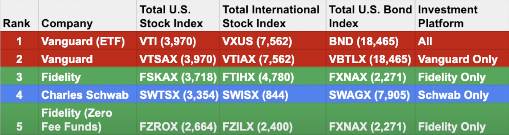
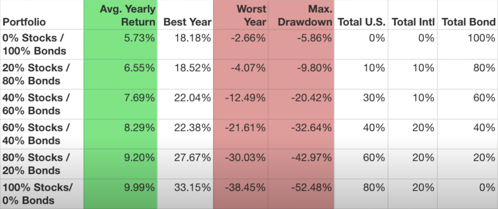

# 3 Fund Portfolio

1. Total US Stock Market Index Fund - This holds every US company in the stock market
2. Total International Stock Index Fund - This holds emerging international companies
3. Total US Bond Index Fund - Has short, medium, and long maturaties

When you hold those 3 funds above, you are basically investing in every stock / bond in the market (~ 21500 total)

## Advantage of this strategy

1. Easy to contribute money to only 3 funds monthly
2. Rebalance yearly across 3 funds is easy
3. Withdrawaling / selling money is easy because there's only 3 funds

## Recommended funds to choose

As of 2022, Vanguard ETFs are the only funds that can be bought on any platform. Also, there are funds that have the 'total market' name but they actually do not hold every stock in the market.

### 401k

Most likely a 401k will not have a total market index fund so you'll need to replace it with an alternative S&P 500 fund. 

## Allocation

% of stocks vs bonds depends on your risk tolerance. Here is a chart showing the performance of stock / bond mixes in the last 30 years (from 2022). For example, if you put 100% in stocks, you have the risk of losing 50% of the money during the 2008 housing crash. You would've had to keep investing for 5 more years to recover the loss. 

## Rebalancing

Should only do this once per year

## Musts

In order to make this strategy successful, be sure to do the following:

1. Invest consistently regardless of the state of the world (dollar cost averaging)
2. Reinvest dividends into the funds

## Resources

1. [3 Fund Portfolio](https://www.youtube.com/watch?v=X7hZQmSj8KI)
