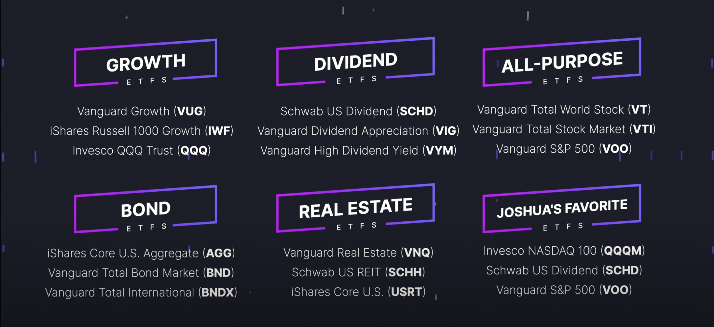

# ETF (Exchange traded funds)

ETF is a basket of investments that trade on the stock market

## How to analyze ETFs

1. View the product summary to know what stocks are comprised of the fund. Check if it's suited for long/short and/or aggressive/consertative investing
2. Look at expense ratio. Should aim for below 0.2%.
3. Performance: Look for the 'Since inception' return to see the average return of the fund
4. Market sector: Look at which industry categories are the funds invested in
5. Distributions: The dividend payments you can expect to receive

## Avoiding fund overlap

Fund overlap happens when you have multiple ETFs that invest in the same stock(s). This reduces the diversification in your portfolio. Use the [ETF research center](https://www.etfrc.com/) to check overlaps and portfolio correlation. Portfolio correlation compares two funds to see if there is any performance relationship. If you want diversification, you can pick funds that are not correlated to each other to mitigate risks. 

## Where do the dividends go after the company pays you?

If you don't reinvest you dividends bank into your fund, it will just be placed into your brokerage account's settlement fund. So make sure to setup DRIP (dividend reinvestment plan).

## Recommendations

## Resources

1. [ETF investing guide](https://www.youtube.com/watch?v=KCZJ6Ttsp-A)
2. [ETF Database](https://etfdb.com/)
3. [ETF Research Center](https://www.etfrc.com/)
