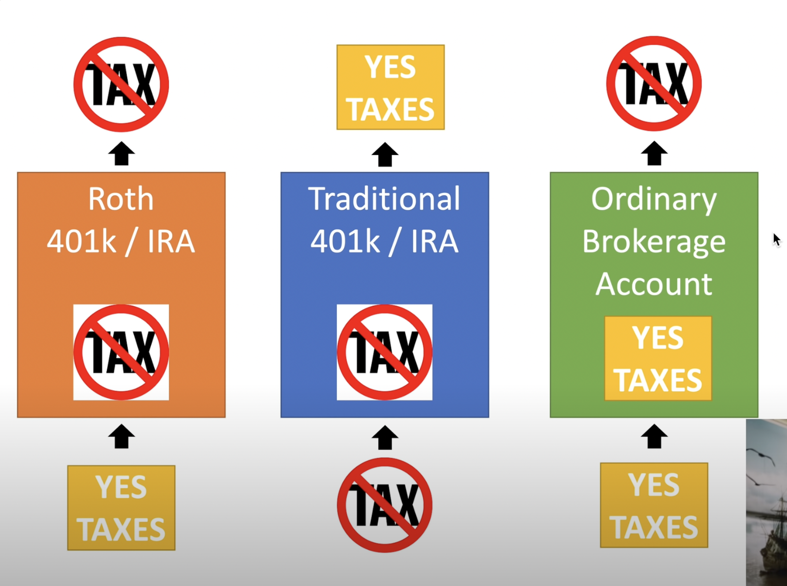
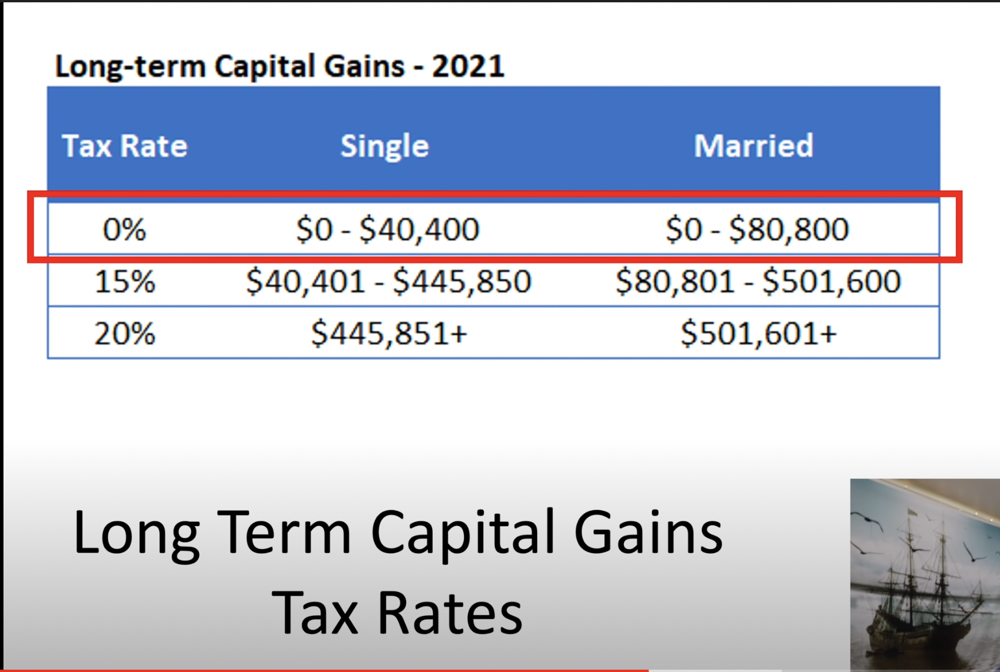

# Investment accounts

There are several platforms in which you can invest your money into. Each have there pros and cons

1. Traditional 401k / IRA
2. Roth 401k / IRA
3. Ordinary Brokerage Account
4. HSA
5. TSP (Thrift Savings Plan): Get the C and I fund

## Taxation

Each investment platform have taxable events at different timings

For ordinary brokerage accounts, if you have long-term capital gains, you might not need to pay taxes if your gains are below $80k married. Note though however you would need to pay dividend taxes yearly.

## Resources

1. [Understanding 401k](https://www.youtube.com/watch?v=bDSEghOx-K8)
